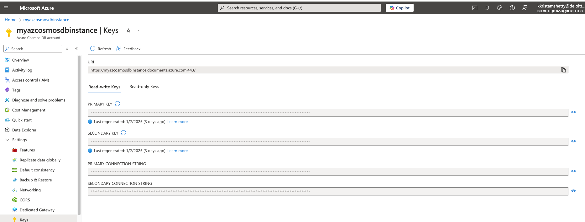
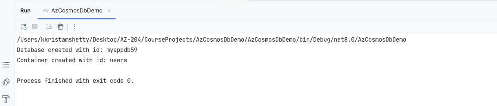
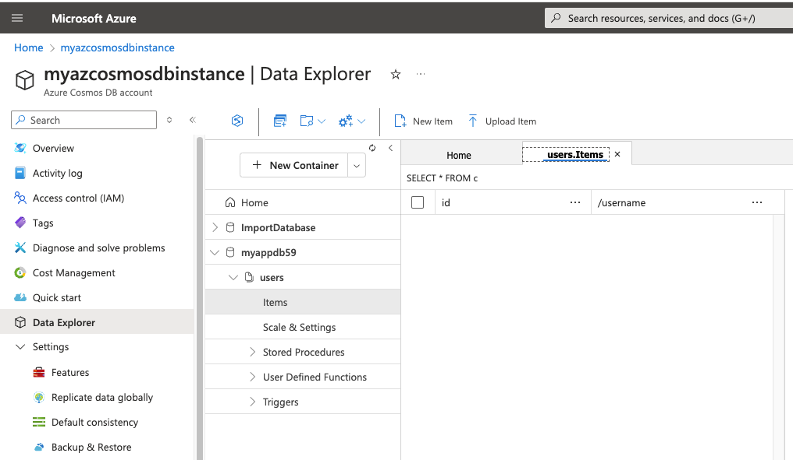
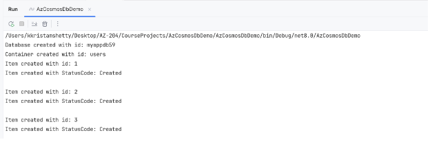
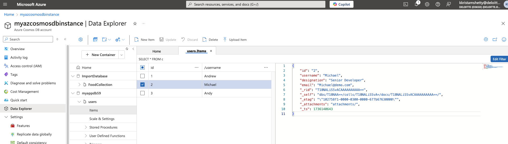
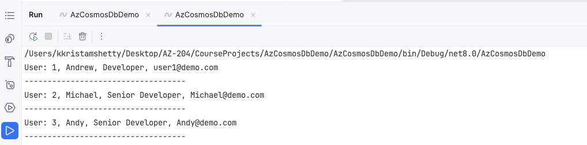

**This console application provides utilities in .NET that makes it easy to interact with Azure Cosmos DB.**

1. Create a new console application from Visual Studio/rider templates.
2. Add the following Nuget packages to the project:
    - Microsoft.Azure.Cosmos
3. Copy the connection string from the Azure portal--> Azure Cosmos DB account--> Keys--> Primary Connection String.

4. Add the following code to the Program.cs file for referencing the connection string.

   **Note:-** Donot expose the connection string publicly. I'm using it here for demonstration purposes only. I will delete this connection string after the demo.
```csharp

string connectionString="AccountEndpoint=https://myazcosmosdbinstance.documents.azure.com:443/;AccountKey=e2qYKqY9NrS95G5YSgRAJGkh79VQN1DH3QGQ6OmpFfezF5dW9TldvvJgj90Z9oKAqEtXJaC3EXY7ACDbe417Dw==;";

```
5. Add the following code to the Program.cs file for creating a new database 
```csharp
CosmosClient client = new CosmosClient(connectionString);
Database database = await client.CreateDatabaseIfNotExistsAsync("myappdb59");
Console.WriteLine("Database created with id: {0}", database.Id);
```
6. Add the following code to the Program.cs file for creating a new container
```csharp
string partitionKey = "/username";
Container container = await database.CreateContainerIfNotExistsAsync("users", partitionKey);
Console.WriteLine("Container created with id: {0}", container.Id);
```
7. Run the application and check the Azure portal for the newly created database and container. See the console logs to verify the successful creation of database and container.





**Adding Items to the container**

8. Add the following code to the Program.cs file for adding items to the container
```csharp
    CosmosClient client = ConnectDatabase();
    Database database = client.GetDatabase(databaseName);
    Container container = database.GetContainer(containerName);
    
    ItemResponse<CosmosUser> item= await container.CreateItemAsync<CosmosUser>(user, new PartitionKey(user.username));
    Console.WriteLine("Item created with id: {0}", item.Resource.id);
    Console.WriteLine("Item created with StatusCode: {0}", item.StatusCode);
    Console.WriteLine("");
```
9. Run the application and check the Azure portal for the newly added items in the container. See the console logs to verify the successful addition of items to the container.

   

10. Navigate to the Azure portal and check the data in the container.
    

**Querying Items from the container**
1. Add the following code to the Program.cs file for querying items from the container
```csharp
   async Task DisplayUsers()
    {
    CosmosClient client = ConnectDatabase();
    Database database = client.GetDatabase(databaseName);
    Container container = database.GetContainer(containerName);
    
    QueryDefinition queryDefinition = new QueryDefinition("SELECT * FROM users");
    FeedIterator<CosmosUser> resultSet = container.GetItemQueryIterator<CosmosUser>(queryDefinition);
    
    while (resultSet.HasMoreResults)
    {
        FeedResponse<CosmosUser> response = await resultSet.ReadNextAsync();
        foreach (CosmosUser user in response)
        {
            Console.WriteLine("User: {0}, {1}, {2}, {3}", user.id, user.username, user.designation, user.email);
            Console.WriteLine("-----------------------------------");
        }
    }
}
```
2. Run the application and check the console logs to verify the successful retrieval of items from the container.

   